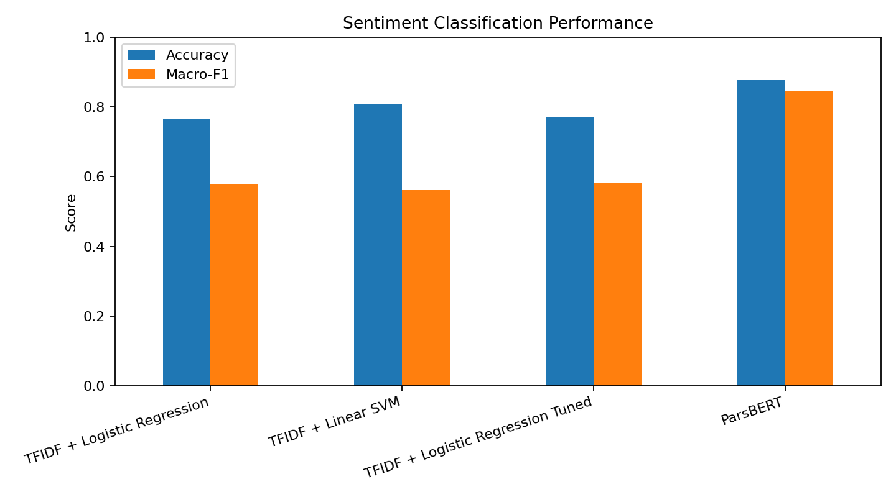
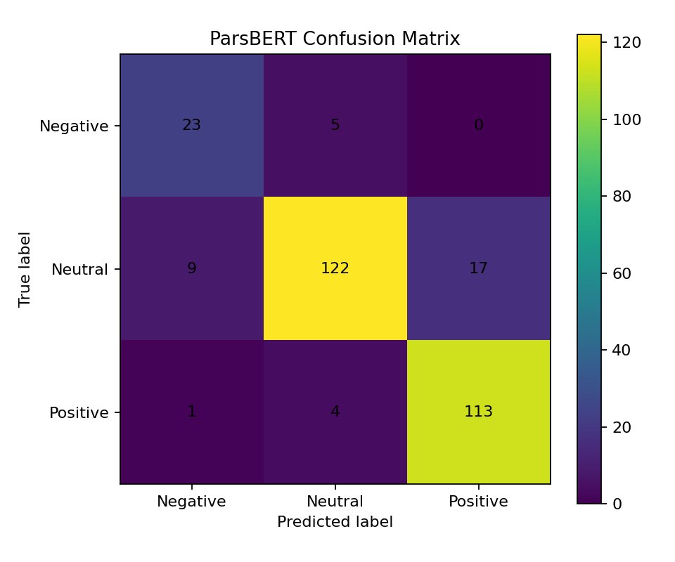

# Persian Aspect-Based Sentiment Analysis of Taaghche Book Reviews

An NLP project for **aspect-based sentiment analysis (ABSA)** on Persian book reviews from Taaghche. The pipeline identifies review aspects, extracts aspect-specific context, and classifies the sentiment of each aspect-context pair as **negative**, **neutral**, or **positive**.

The project compares classical TF-IDF baselines with a fine-tuned **ParsBERT** classifier and focuses on the additional challenges of informal Persian text, multi-aspect reviews, and context boundaries.

## Highlights

- Processed a frozen corpus of **70,410 Persian reviews** after preprocessing.
- Extracted **46,221 aspect-context pairs** across **11 aspects** from **29,708 comments** and **193 books**.
- Built a labeled sentiment dataset of **2,931 aspect-context pairs** for multi-aspect reviews.
- Fine-tuned `HooshvareLab/bert-base-parsbert-uncased` using class-weighted cross-entropy.
- ParsBERT achieved **87.76% test accuracy** and **0.8466 Macro-F1** on a held-out test set of 294 samples.
- Classical TF-IDF baselines reached up to **80.79% accuracy** and **0.5817 Macro-F1**.

## Problem

A single book review can express different opinions about different aspects of a book. For example, a reader may like the story but dislike the translation. Assigning one sentiment label to the whole review can therefore lose important information.

This project models sentiment at the **aspect-context** level:

`review -> detected aspects -> aspect-specific context -> sentiment classification`

## Pipeline

1. **Persian review preprocessing**
2. **Rule-based aspect detection** using frozen aspect patterns
3. **Aspect-aware context extraction** for multi-aspect comments
4. **Baseline sentiment classification** with TF-IDF + Logistic Regression / Linear SVM
5. **Gold sentiment dataset preparation** for multi-aspect reviews
6. **ParsBERT fine-tuning** with class weighting
7. **Evaluation** using Accuracy, Precision, Recall, Macro-F1, Weighted-F1, and a confusion matrix

## Aspect Taxonomy

The extracted aspect-context dataset contains 11 aspect categories:

| Aspect | Extracted contexts |
|---|---:|
| Story | 21,571 |
| Content | 9,439 |
| Author | 6,122 |
| Translation | 3,527 |
| Writing style | 2,733 |
| Audio narrator | 914 |
| Price | 629 |
| Publisher | 598 |
| Censorship | 393 |
| Print / editing | 214 |
| Cover design | 81 |

## Model Results

### Classical baselines

| Model | Accuracy | Macro-F1 |
|---|---:|---:|
| TF-IDF + Logistic Regression | 0.7654 | 0.5789 |
| TF-IDF + Linear SVM | **0.8079** | 0.5607 |
| TF-IDF + Tuned Logistic Regression | 0.7711 | **0.5817** |

### ParsBERT

| Metric | Score |
|---|---:|
| Test Accuracy | **0.8776** |
| Macro Precision | 0.8325 |
| Macro Recall | 0.8678 |
| Macro-F1 | **0.8466** |
| Weighted-F1 | 0.8778 |

Per-class test F1 scores:

- Negative: **0.7541**
- Neutral: **0.8746**
- Positive: **0.9113**





## Repository Structure

```text
.
├── README.md
├── requirements.txt
├── assets/
│   ├── model_comparison.png
│   └── parsbert_confusion_matrix.png
├── config/
│   └── taaghche_frozen_aspect_rules.json
├── data/
│   └── README.md
├── docs/
│   └── project_report.pdf
├── notebooks/
│   └── research_pipeline.ipynb
├── results/
│   ├── aspect_detection_overall_results.csv
│   ├── aspect_detection_per_class_results.csv
│   ├── baseline_results_context_based.csv
│   ├── parsbert_classification_report.csv
│   ├── parsbert_confusion_matrix.csv
│   └── parsbert_training_history.csv
└── src/
    ├── context_extraction.py
    └── summarize_results.py
```

## Reproducibility Note

The notebook preserves the original research workflow. The raw Taaghche corpus, intermediate files, the manually/pre-labeled gold annotation file, and row-level prediction files are **not included in this public portfolio version**. This avoids redistributing bulk user-generated review text and keeps personal/project-internal data out of the repository.

The repository includes the rule configuration, aggregate evaluation outputs, training history, the research notebook, and a standalone context-extraction module.

## Quick Start

Create an environment and install the dependencies:

```bash
pip install -r requirements.txt
```

Run the aggregate result summary:

```bash
python src/summarize_results.py
```

The context extraction module can be run directly for a small demonstration:

```bash
python src/context_extraction.py
```

## Tech Stack

**Python**, **pandas**, **NumPy**, **scikit-learn**, **PyTorch**, **Hugging Face Transformers**, **Datasets**, **ParsBERT**, **Jupyter**, and regular-expression-based Persian text processing.

